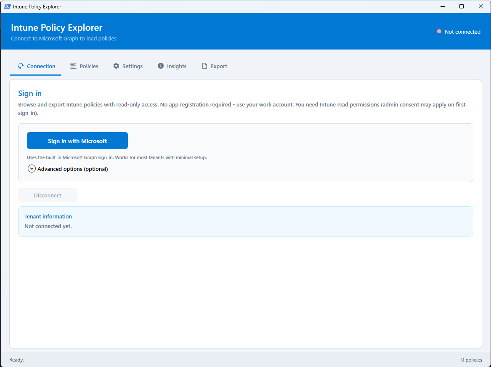
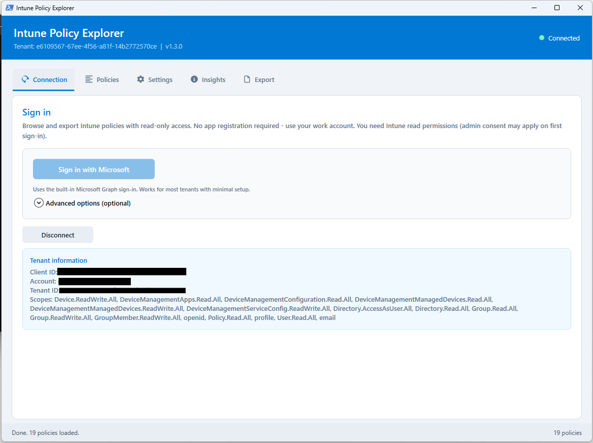
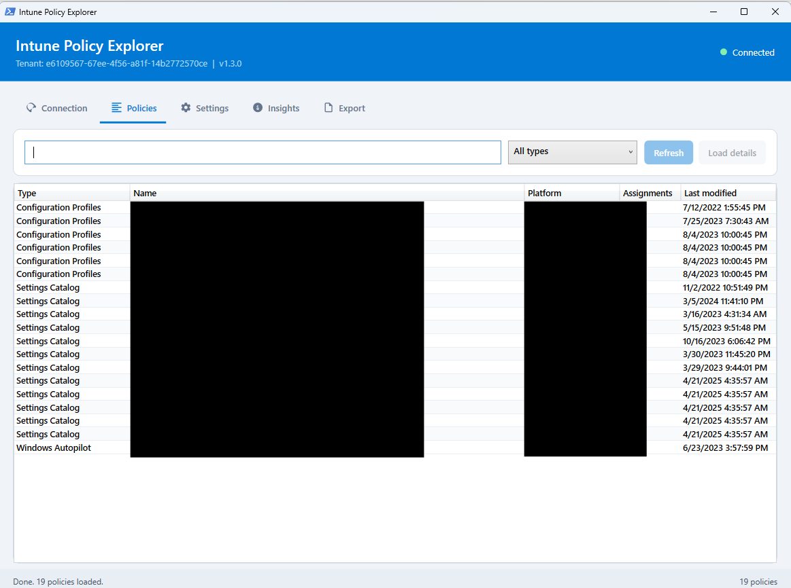
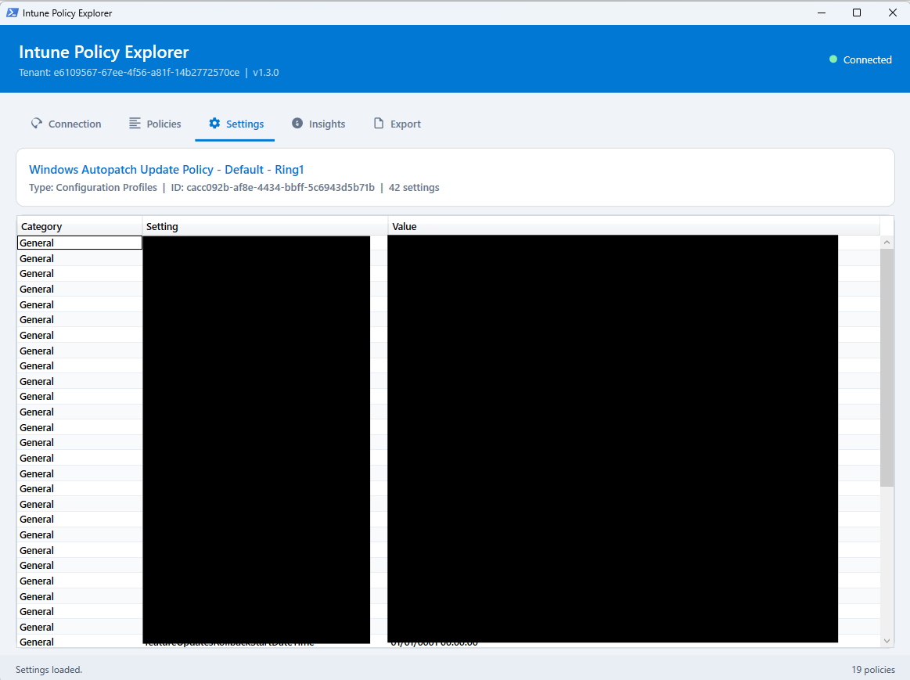
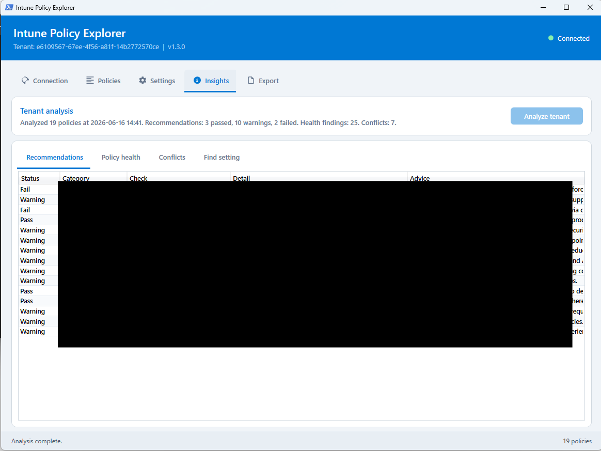
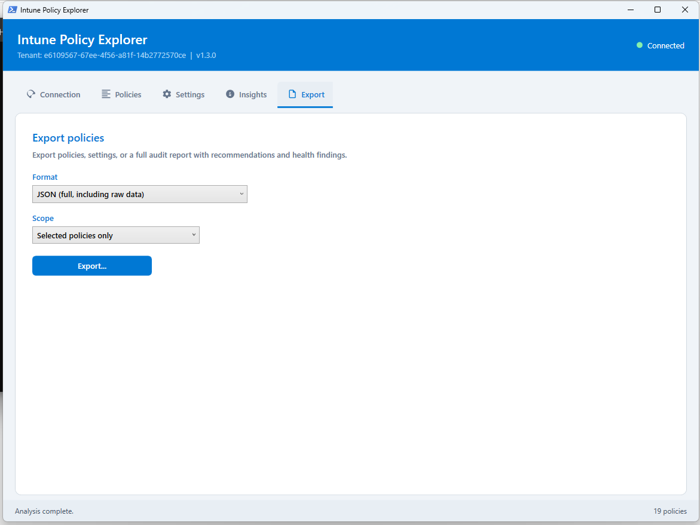

# Intune Policy Explorer

Open-source PowerShell GUI to **browse, analyze, search, and export** Microsoft Intune policies. Read-only — no policy changes.

[](https://www.powershellgallery.com/packages/IntunePolicyExplorer)
[](https://opensource.org/licenses/MIT)

- **Repository:** https://github.com/enginsoysal/IntunePolicyExplorer
- **Gallery:** https://www.powershellgallery.com/packages/IntunePolicyExplorer
- **License:** MIT

## Screenshots

### Connection — sign in



### Connection — signed in



### Policies — browse and filter



### Settings — inspect policy configuration



### Insights — recommendations, health, conflicts & search



### Export — JSON, CSV, HTML & audit report



## Quick start

```powershell
Install-Module IntunePolicyExplorer -Scope CurrentUser -Force
Show-IntunePoliciesGUI
```

Or run from source:

```powershell
git clone https://github.com/enginsoysal/IntunePolicyExplorer.git
cd IntunePolicyExplorer
.\Show-IntunePoliciesGUI.ps1
```

Click **Sign in with Microsoft**. No app registration required.

On first run, `Microsoft.Graph.Authentication` is installed automatically if needed.

## Who is this for?

Intune administrators who need more than the Intune portal list view:

- **Discover** policies across all major Intune policy types
- **Inspect** settings per policy
- **Analyze** the tenant (recommendations, health, conflicts)
- **Search** settings across all policies (e.g. BitLocker, Defender)
- **Export** documentation and audit reports (JSON, CSV, HTML)

No custom Entra app registration is required for typical use.

## Features (v1.3)

| Area | What you get |
|------|----------------|
| **Policies** | Unified list with type, platform, assignments, last modified |
| **Settings** | Per-policy settings view from Microsoft Graph |
| **Insights** | 16 recommendation checks (encryption, compliance, Defender, ASR, updates, Autopilot, MAM, …) |
| **Policy health** | Unassigned policies, stale policies (>12 months), duplicate names |
| **Conflicts** | Same setting configured with different values across policies |
| **Find setting** | Cross-policy search by setting name or value |
| **Export** | JSON, CSV, HTML policy export + **HTML Audit Report** |

Click **Analyze tenant** on the Insights tab to run the full analysis (loads assignments and policy details).

## Requirements

- Windows 10/11, PowerShell 5.1+
- Work or school account with **Intune read access** (e.g. Intune Reader role or equivalent)
- Microsoft Graph **delegated read** permissions (requested on first sign-in):
  - `DeviceManagementConfiguration.Read.All`
  - `DeviceManagementApps.Read.All`
  - `DeviceManagementManagedDevices.Read.All`
  - `Policy.Read.All`

## Sign-in

### Default (recommended)

**Sign in with Microsoft** uses the built-in Microsoft Graph sign-in flow:

1. Browser or sign-in window opens
2. Sign in with your work account
3. Approve read permissions (admin consent may already exist in your tenant)
4. Policies load automatically

### Advanced options (optional)

Only needed when default sign-in is blocked by **Conditional Access** (e.g. device code flow blocked).

Expand **Advanced options** and provide your own Entra app:

- Tenant ID
- Client ID
- Scopes (optional — leave empty for recommended Intune read scopes)

## Supported policy types

- Configuration Profiles
- Settings Catalog
- Compliance policies
- Administrative Templates (ADMX)
- Endpoint Security
- Windows Autopilot
- App Protection (iOS / Android / Windows)
- Mobile App Configurations

Unavailable types are skipped with a warning (depends on your permissions).

## Export

| Format | Contents |
|--------|----------|
| **JSON** | Full policy + settings + raw Graph object |
| **CSV** | Policy overview + separate settings CSV |
| **HTML** | Readable per-policy documentation report |
| **HTML Audit Report** | Recommendations, health findings, conflicts, and full policy inventory |

Export selected policies or all loaded policies. The audit report always covers the full tenant analysis.

## Troubleshooting

| Issue | What to try |
|-------|-------------|
| Device code blocked by CA | Use **Advanced options** with your own Entra app |
| Invalid scope error | Update module: `Update-Module IntunePolicyExplorer -Force` |
| Empty policy list | Disconnect and sign in again; approve all Intune read scopes |
| Analysis errors | Run **Refresh** on Policies tab first, then **Analyze tenant** |
| Sign-in window closes | Update Graph module: `Update-Module Microsoft.Graph.Authentication -Force` |

## Development

```powershell
git clone https://github.com/enginsoysal/IntunePolicyExplorer.git
.\Show-IntunePoliciesGUI.ps1
```

This repository contains a single self-contained script: `Show-IntunePoliciesGUI.ps1`.

Install from Gallery for production use:

```powershell
Install-Module IntunePolicyExplorer -Scope CurrentUser -Force
Show-IntunePoliciesGUI
```

## License

MIT License — Copyright (c) 2026 Engin Soysal.
